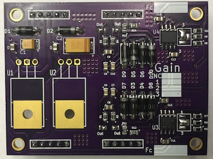

# Dual Channel Instrumentation Amplifier

## Purpose

To provide an easy way to buffer, amplify, and filter analog signals. This is a
common problem in prototyping and laboratory settings where instrumentation is
often tested, changed, reconfigured, etc. This instrumetation grade product is
built around the INA128 amplifier.

## Purchasing

The dual channel instrumentation amplifier is available through Leeman
Geophysical by emailing [John R. Leeman](http://www.johnrleeman.com) at
<kd5wxb@gmail.com>.

## Project Information

This repository includes all design information, CAD files, PDF CAD output,
gerbers, etc.

Additional resources for this project include:

- [Bill of Materials](BoM.md) (BoM)
- [INA128 Datasheet](PDFs/ina128.pdf)

## License

This product is licenced under the CERN Open Hardware License 1.2. The [full
license](cern_ohl_v_1_2.txt) is included in this repository.

## Hookup Guide

Hookup is self-explanitory, but some basic guidelines and cautions
are provided below.

- Apply power and ground to the GND, Vin+, and Vin- terminals. The input voltage
should follow the specifications for the voltage regulators fitted on your
device. Normally 2-3 V over the regualted voltage is ideal.

- Apply signal to the In+ and In- terminals

- Hookup the output to your device (recorder, process, etc) via the Out+ and
Out- terminals

- Note: Regulated power is available, but be mindful of the current pulled by
sensors to not exceed the ratings of the on-board voltage regulators.  
